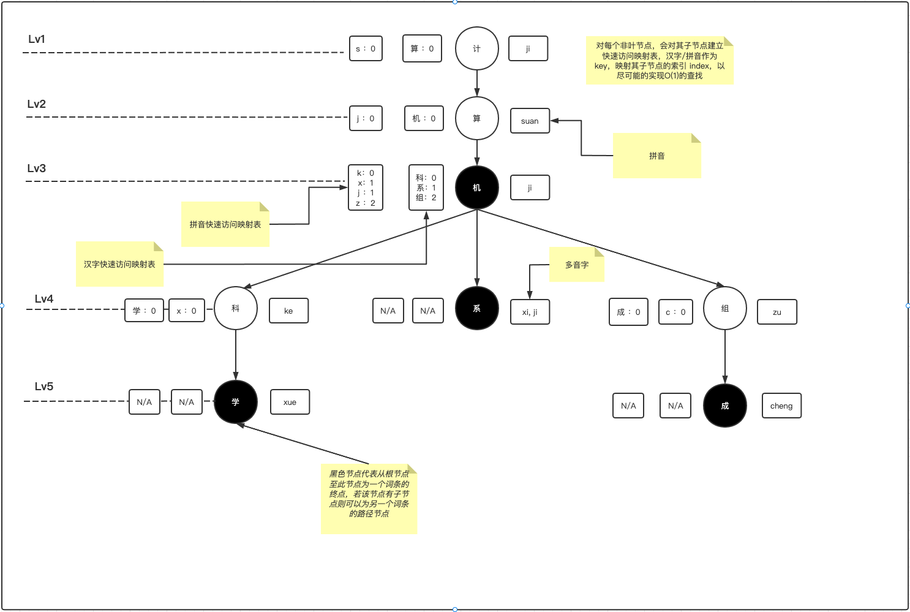
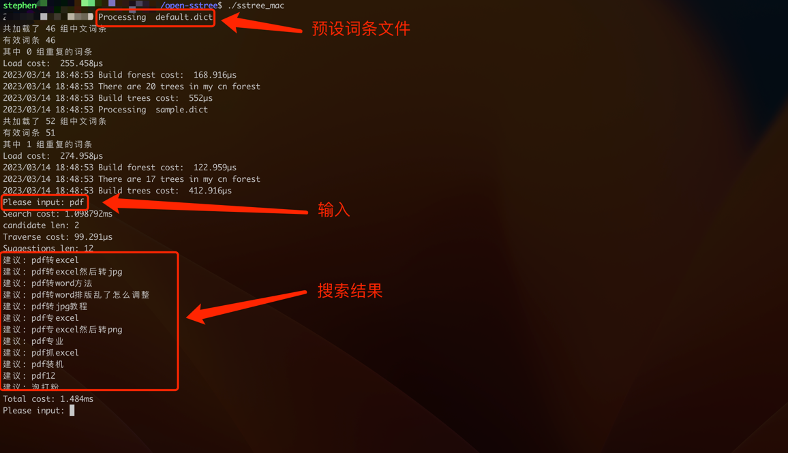
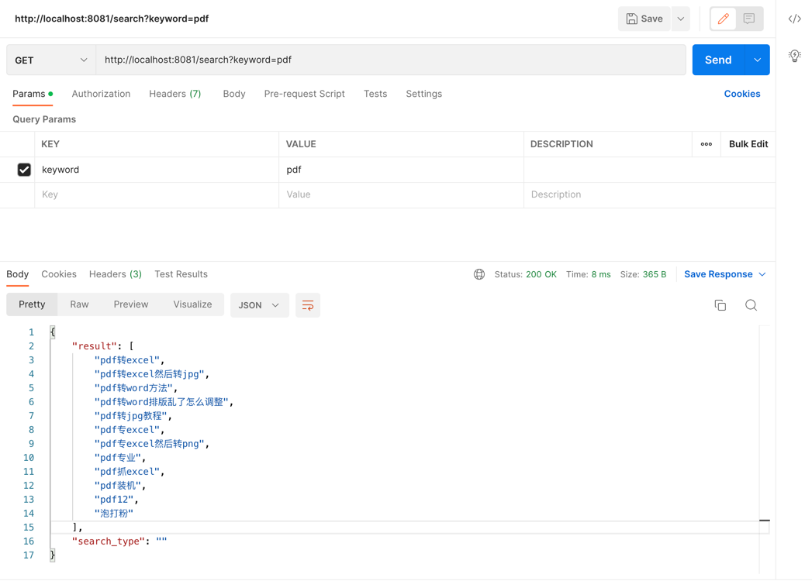

# open-sstree
Open Search Suggestion Tree - 搜索建议树
--

以谷歌为例，用户在输入过程中会提示通过前缀匹配的方式给出搜索的候选词条辅助用户补全输入
 

 

这个机制可以给用户非常快的搜索体验，同时也给用户提供候选输入，通过选择候选词条提交的query搜索引擎返回的结果相对会更精准（预设词条一般来自于历史搜索query）
 

核心原理
----

前缀树，拼音解析2个算法是本搜索建议算法的核心基石，加上大量的嵌套递归实现，目前已支持中文，英文，拼音，以及混合输入进行查找补全，完成搜索建议

数据结构如下图：
 

构建
----

启动时加载预设词条，逐行逐字读取default.dict，并且对中文字符添加相应的拼音索引以同时满足中文和拼音搜索

搜索
----

对输入的字符token做预处理，按照英文和非英文进行分token，然后逐个token逐字处理，
对中文部分逐字进行字符查找，英文部分进行字符查找+拼音查找，
整个是一个嵌套递归的过程，逐字查找候选节点，然后将候选节点传递给下一个token进一步查找的过程

运行
----

git clone https://github.com/chrwhy/open-pinyin.git
 

git clone https://github.com/chrwhy/open-sstree.git
 

cd open-sstree
 

go mod tidy
 

命令行模式
----

go run main.go
 

web模式(默认开启8081端口)
----

go run main.go web
 

keyword:搜索关键字
 

http://localhost:8081/search?keyword=pdf
 

二进制
----

CGO_ENABLED=0 GOOS=linux GOARCH=amd64
 
go build  -o sstree_linux main.go
 

CGO_ENABLED=0 GOOS=windows GOARCH=amd64
 
go build -o sstree_win.exe main.go
 

CGO_ENABLED=0 GOOS=darwin GOARCH=amd64
 
go build -o sstree_mac main.go
 
